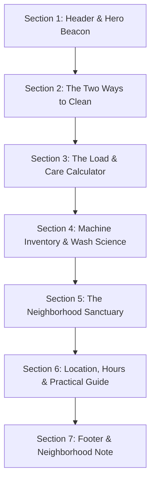

# Creative Web Development Plan: Neighborhood Laundromat Experience

---

## 1. Reference Loading Contract & Receipts

In accordance with `.agents/skills/creative-web-development/SKILL.md`, all routed domain references have been read completely and enforced in this plan.

### Reference Manifest & Compact Receipts

| Reference File | Governed Capability | Applied Non-Obvious Constraint |
|---|---|---|
| `references/creative-direction.md` | Sparse brief routing, domain excavation, concept divergence & contract | Ambiguity is permission to make creative decisions, not permission to manufacture operational business facts. Operational parameters (hours, pricing, inventory) are strictly quarantined as provisional/unknown. Candidate generation must quarantine first associations and span at least three distinct concept lenses. |
| `references/concept-evaluation.md` | Candidate scoring, hard gates & stress testing | The solution must pass the **10-Second Utility Test** (visitors from search or maps must obtain hours, location, and machine types without engaging expressive narrative) and the **Noun-Substitution Test** (if the concept works when substituting a bakery or café, it fails ownability). |
| `references/terminology.md` | Canonical creative development vocabulary | Eliminates decorative tropes ("widgets", "flashy effects") in favor of structural concepts: Signature Interaction, Virtual Playhead progression, Dual-DOM Accessibility Pattern, and Material Grounding. |
| `references/motion-and-scroll.md` | Motion laws, kinetic typography & accessibility fallbacks | Enforces a Dual-DOM accessibility pattern for any kinetic type reveals to prevent screen-reader spelling errors, and requires instant functional state switches when `prefers-reduced-motion: reduce` is active. |

---

## 2. Phase 0: Request Contract & Truth Ledger

### Deliverable Scope
- **Deliverable**: Comprehensive Creative Direction & Experience Architecture Plan.
- **Boundary**: Stop after Experience Architecture (Phase 2). No code implementation, build scripts, or dependency installations at this stage.

### Truth Ledger

```
┌──────────────────────────────────────────────────────────────────────────────┐
│                                TRUTH LEDGER                                  │
├──────────────────┬───────────────────────────┬───────────────────────────────┤
│ KNOWN            │ PROVISIONAL (Working      │ UNKNOWN (Requires Owner       │
│ (Explicit Facts) │ Design Assumptions)       │ Real-World Input)             │
├──────────────────┼───────────────────────────┼───────────────────────────────┤
│ • Small local    │ • Hybrid service model:   │ • Official business name      │
│   neighborhood   │   Self-service washers/   │ • Exact street address & city │
│   laundromat     │   dryers + Drop-off Wash  │ • Daily operating hours &     │
│ • Client is non- │   & Fold service          │   last wash cut-off time      │
│   technical and  │ • Residential community   │ • Machine inventory counts    │
│   wants guidance │   foot-traffic audience   │   and capacities (lb / kg)    │
│ • Plan-first     │ • On-site amenities:      │ • Payment methods accepted    │
│   contract       │   seating, folding tables,│   (coins, card, contactless)  │
│                  │   vending, guest Wi-Fi    │ • Turnaround time and pricing │
│                  │                           │   per pound for drop-off      │
└──────────────────┴───────────────────────────┴───────────────────────────────┘
```

### Visitor Jobs & Non-Negotiable Utility
1. **The Instant Urgency Job (0–5 seconds)**: "Are you open right now?", "Where are you located?", "What is the last wash time?", "Do you take credit cards or coins only?"
2. **The Bulky Item Job (5–15 seconds)**: "Do you have large machines that can handle my king-size duvet / heavy winter rugs?"
3. **The Drop-Off / Convenience Job (15–30 seconds)**: "How much does wash-and-fold cost per pound, how does drop-off work, and when can I pick it up?"
4. **The Comfort & Safety Check**: "Is the space clean, bright, attended, and comfortable to sit in while waiting?"

---

## 3. Phase 1: Establish the Governing Concept

### 3.1 Domain Excavation (6 Lenses)

1. **Functional Truth**: Laundry is an elemental transformation of state. Soiled, chaotic, wrinkled, heavy textiles enter; they undergo sorted water/temperature agitation and extraction; they emerge as warm, crisp, aromatic, geometrically stacked order.
2. **Visitor Reality**: Arriving visitors carry mundane anxiety—broken machines elsewhere, running out of quarters, ruined delicates, wasted hours, or bulky bedding that won't fit home washers. They need immediate reassurance of cleanliness, reliability, and ease.
3. **Human Ritual**: The laundromat is a liminal "third space"—a planned, quiet pause in the week. People read books, listen to podcasts, study, or chat while machines hum. The sensory peak is the tactile warmth of clean towels fresh from the tumble dryer.
4. **Material Behavior**: Heavy natural cotton canvas, raw denim, crisp linen weave, terry cloth; brushed stainless steel drums, warm brass/enamel signage, tactile dial clicks, paper claim tickets, steam, and crisp folding creases.
5. **Cultural Tension**: Generic laundromats are often stereotyped as harsh, flickering, dimly lit, coin-choked basements. A modern neighborhood laundromat flips this into a radiant, clean, tactile sanctuary of domestic care.
6. **Native Language**: *Wash & Fold, Per Pound ($/lb), Heavy Load, Gentle Cycle, Tumble Dry, Cold Rinse, Pocket Check, Care Label, Folding Table, Last Wash Call, High-Extract.*

### 3.2 Quarantine of First Associations

- **The Quarantined Clichés**:
  1. *The 3D Spinning Drum with Bubble FX*: A giant cartoon washing machine splashing blue digital water and suds across the viewport.
  2. *The Clinical SaaS Detergent Look*: Sterile medical cyan and blue gradients with generic stock models holding detergent bottles.
  3. *The Nostalgic 1950s Kitsch Diner*: Pastel pink/teal badges with retro cartoon soap suds that trivialize the business into a costume.
- **Why Quarantined**: These treatments reduce a tactile neighborhood service to superficial digital gimmicks or sterile corporate templates, failing to communicate cleanliness, craftsmanship, or immediate utility.

---

### 3.3 Divergence Across 3 Concept Families

```
┌──────────────────────────────────────────────────────────────────────────────┐
│                            CONCEPT DIVERGENCE                                │
├──────────────────────────────────────────────────────────────────────────────┤
│ CANDIDATE A (Material / Process): "The Fresh Press & Fold" [SELECTED]       │
│ • Proposition: An artisanal, tactile broadsheet translating fabric care and  │
│   crisp geometric folding into an effortless, warm neighborhood portal.      │
│ • Structure: Hybrid Editorial-Utility.                                       │
│ • Signature: "Load & Care Estimator" (Interactive Fabric & Capacity Sorter). │
├──────────────────────────────────────────────────────────────────────────────┤
│ CANDIDATE B (Ritual / Third Space): "The Neighborhood Cycle"                 │
│ • Proposition: A circadian community sanctuary framing laundry time as a     │
│   restorative, hospitable weekly pause.                                      │
│ • Structure: Narrative Place Progression.                                    │
│ • Signature: "Sanctuary Amenity Dial" (Atmosphere & quiet-hour viewer).      │
├──────────────────────────────────────────────────────────────────────────────┤
│ CANDIDATE C (System / Telemetry): "The Live Bay Stream"                      │
│ • Proposition: A high-density operational telemetry board tracking live drum │
│   availability and cycle timing.                                             │
│ • Structure: Pure Utility Dashboard.                                         │
│ • Signature: "Live Machine Grid" (Dynamic bay capacity indicators).          │
└──────────────────────────────────────────────────────────────────────────────┘
```

#### Detailed Candidate Profiles

* **Candidate A — "The Fresh Press & Fold" (Material & State-Change Lens)**
  * *Governing Proposition*: A tactile, material-grounded digital broadsheet that translates the physical satisfaction of sorting, washing, and crisp folding into an orderly, reassuring experience.
  * *Domain Truth*: Laundry is the satisfying transformation of wrinkled chaos into warm, crisp geometric order.
  * *Visitor Promise*: Eliminates chore anxiety by demonstrating impeccable cleanliness, machine sizing, and transparent drop-off care.
  * *Experience Structure*: Hybrid Editorial-Utility.
  * *Visual World*: Warm steamed-linen background (`#FBF9F5`), deep indigo ink typography (`#1A2433`), brass/terracotta warmth accents (`#D96B43` and `#C49A45`), crisp single-pixel fold rules, and macro photography of textured weaves and gleaming drums.
  * *Motion Law*: Crisp geometric unfolding—elements reveal along clean crease lines with slight elastic settle, echoing folded textiles.
  * *Signature Interaction*: **The Load & Care Calculator**—an interactive textile selector where visitors choose their items (e.g. Daily Wear, Bulky Comforter, Delicates) to immediately receive recommended washer size, turnaround estimate, and drop-off vs. self-serve pricing.
  * *Utility Integration*: Pinned header with persistent live status ("Open until 10 PM • Last wash 9 PM"), Google Maps directions trigger, and tap-to-call.
  * *Ownability*: Deeply rooted in fabric weights, care labels, and fold geometry.

* **Candidate B — "The Neighborhood Cycle" (Ritual & Place Lens)**
  * *Governing Proposition*: A warm circadian narrative celebrating the laundromat as a sunlit neighborhood third space for reading, relaxing, and community connection.
  * *Domain Truth*: The laundromat is one of the last true physical community crossroads where time is spent quietly.
  * *Weakness*: Prioritizes atmosphere over rapid pricing and machine capacity answers; risks feeling like an artisanal coffee shop rather than a functional laundry utility.

* **Candidate C — "The Live Bay Stream" (System & Telemetry Lens)**
  * *Governing Proposition*: An ultra-utilitarian operational dashboard providing live machine availability, capacity gauges, and cycle countdowns.
  * *Domain Truth*: The biggest friction is arriving with heavy bags only to find all washers occupied.
  * *Weakness*: Fails the factual integrity hard gate for a small independent laundromat without verified IoT connected hardware; cold aesthetic lacks neighborhood hospitality.

---

### 3.4 Concept Evaluation & Selection Record

#### Rubric Evaluation (Scale 1–5)

| Evaluation Dimension | Candidate A (Fresh Press & Fold) | Candidate B (Neighborhood Cycle) | Candidate C (Live Bay Stream) |
|---|:---:|:---:|:---:|
| **Domain Truth** | **5** (Rooted in fabric state change) | **4** (Captures social ritual) | **4** (Captures machine anxiety) |
| **Originality** | **5** (Elevates laundry to clean craft) | **4** (Warm lifestyle aesthetic) | **3** (Standard dashboard) |
| **Ownability** | **5** (Breaks if applied to other shops) | **3** (Could be a café or bookstore) | **4** (Laundry specific) |
| **Coherence** | **5** (Type, motion, palette match folds) | **4** (Cohesive mood) | **3** (Disconnected from craft) |
| **Interaction Necessity** | **5** (Calculator answers core questions) | **3** (Atmospheric dial is decorative) | **4** (Helpful if real-time data exists) |
| **Visitor Intelligence** | **5** (Instant answers + guided utility) | **3** (Atmosphere delays answers) | **5** (High utility speed) |
| **Art-Direction Specificity** | **5** (Concrete materials, type & ink) | **4** (Warm photo-led rules) | **3** (Flat UI components) |
| **Restraint** | **5** (No 3D bubbles or fake gizmos) | **4** (Restrained) | **4** (Clean but technical) |
| **Feasible Ambition** | **5** (Lightweight semantic execution) | **4** (High photo dependency) | **2** (Requires complex IoT API) |
| **Recall** | **5** ("The crisp, organized linen site") | **4** ("The cozy laundromat") | **3** ("A status page") |
| **Total Score** | **49 / 50** | **39 / 50** | **35 / 50** |

#### Stress Tests Applied to Candidate A
1. **Noun-Substitution Test**: *PASSED*. Substituting a bakery, dry cleaner, or café breaks the care-label logic, machine drum poundage ratings, and crease-fold visual grammar.
2. **Interaction-Removal Test**: *PASSED*. Removing the Load & Care Calculator deprives visitors of instant machine sizing and price-per-pound estimation, proving it is functional utility, not decoration.
3. **10-Second Utility Test**: *PASSED*. A visitor arriving on mobile sees the open/closed status badge, phone number, address, and pricing within the first viewport fold without scrolling.
4. **Trope-Inheritance Test**: *PASSED*. Rejects all cliché floating suds, particle simulations, dark tech voids, and parallax noise.

#### Selection Decision
**Selected Winner**: **Candidate A — "The Fresh Press & Fold"**.
- **Rationale**: Achieves the highest balance of distinctive tactile art direction, flawless utility, and domain authenticity without requiring unverified live telemetry hardware.
- **Strongest Rejected Alternative**: Candidate B (lost due to soft utility and potential brand ambiguity).
- **Primary Creative Risk**: Ensuring the "creased paper/folded fabric" aesthetic feels crisp and clean rather than dusty or rustic.
- **Risk Mitigation**: Ground the design in crisp Swiss-influenced typography, high-contrast indigo on ecru, and bright, clean imagery of stainless steel machinery.

---

### 3.5 The Formal Concept Contract

```
┌──────────────────────────────────────────────────────────────────────────────┐
│                               CONCEPT CONTRACT                               │
├───────────────────────┬──────────────────────────────────────────────────────┤
│ Field                 │ Specification Decision                               │
├───────────────────────┼──────────────────────────────────────────────────────┤
│ 1. Concept            │ "The Fresh Press & Fold: The Tactile Neighborhood    │
│                       │  Laundry Sanctuary."                                 │
│ 2. Experience Promise │ Instills immediate confidence through spotless       │
│                       │ cleanliness, transparent pricing, and effortless     │
│                       │ machine sizing guidance.                             │
│ 3. Visitor Jobs       │ Hours & live status, machine capacities, drop-off    │
│                       │ pricing, amenities & directions.                     │
│ 4. Structure          │ Hybrid Editorial-Utility (Persistent action layer    │
│                       │ surrounding an interactive care core).               │
│ 5. Composition        │ Asymmetrical broadsheet grid with crisp hairline     │
│                       │ borders, clear margins, and breathing room.          │
│ 6. Typography         │ Structured modern serif for editorial warmth paired  │
│                       │ with a clean geometric sans for utility data.        │
│ 7. Material & Color   │ Steamed Linen (#FBF9F5), Deep Indigo (#1A2433),      │
│                       │ Warm Terracotta (#D96B43), Crisp White (#FFFFFF).    │
│ 8. Imagery            │ Natural light, clean stainless steel drums, freshly  │
│                       │ folded linen stacks, warm interior seating.          │
│ 9. Motion Law         │ Clean geometric unfolding along crease lines with a  │
│                       │ crisp 0.4s deceleration curve.                       │
│ 10. Signature         │ The Load & Care Calculator: Interactive item sorter  │
│     Interaction       │ matching laundry volume to machine sizes & pricing.  │
│ 11. Sound             │ Explicitly omitted (silent, respectful utility).      │
│ 12. Responsive        │ Bottom-anchored mobile quick-action sheet with       │
│     Expression        │ horizontal swipeable load selector.                  │
│ 13. Accessibility     │ WCAG AAA contrast, keyboard focus rings, full        │
│     Expression        │ semantic Dual-DOM copy, reduced-motion bypass.       │
│ 14. Restraint         │ No 3D canvas bubbles, no auto-playing sound, no      │
│     (Excluded)        │ scroll hijacking, no unverified real-time telemetry. │
│ 15. Unknowns          │ Actual business name, exact street location, machine │
│     (To Confirm)      │ poundage breakdown, exact price per pound.           │
└───────────────────────┴──────────────────────────────────────────────────────┘
```

---

## 4. Phase 2: Experience Architecture & Art Direction

### 4.1 Structural Model: Hybrid Editorial-Utility

The experience is structured to satisfy both urgent mobile queries and exploratory desktop visitors through three coordinated layers:

```
┌──────────────────────────────────────────────────────────────────────────────┐
│ 1. PERSISTENT UTILITY HEADER (Always visible: Status, Hours, Phone, Map)     │
├──────────────────────────────────────────────────────────────────────────────┤
│ 2. HERO & LIVE STATUS CARD (Spotless cleanliness promise + Hours badge)      │
├──────────────────────────────────────────────────────────────────────────────┤
│ 3. SERVICE SPECTRUM: SELF-SERVE & DROP-OFF (Side-by-side comparative clarity)│
├──────────────────────────────────────────────────────────────────────────────┤
│ 4. SIGNATURE INTERACTION: THE LOAD & CARE CALCULATOR (Interactive Sizer)     │
├──────────────────────────────────────────────────────────────────────────────┤
│ 5. MACHINE INVENTORY & FABRIC GUIDE (Capacities: 20lb, 40lb, 60lb, 80lb)     │
├──────────────────────────────────────────────────────────────────────────────┤
│ 6. THE SANCTUARY & AMENITIES (Wi-Fi, Seating, Detergent Bar, Coffee)         │
├──────────────────────────────────────────────────────────────────────────────┤
│ 7. LOCATION, PARKING & LAST WASH POLICY (Map, Directions, Payment types)     │
├──────────────────────────────────────────────────────────────────────────────┤
│ 8. PERSISTENT MOBILE UTILITY DOCK (One-tap Directions, Call, Hours)          │
└──────────────────────────────────────────────────────────────────────────────┘
```

---

### 4.2 Visual System & Design Tokens

```
┌──────────────────────────────────────────────────────────────────────────────┐
│                                DESIGN TOKENS                                 │
├───────────────────┬──────────────────────────┬───────────────────────────────┤
│ TOKEN             │ VALUE / SPECIFICATION    │ INTENDED ROLE                 │
├───────────────────┼──────────────────────────┼───────────────────────────────┤
│ Color: Background │ Steamed Linen `#FBF9F5`  │ Warm, organic, tactile canvas │
│ Color: Surface    │ Pure Wash White `#FFFFFF`│ Card backgrounds & containers │
│ Color: Ink Dark   │ Deep Indigo `#1A2433`    │ Primary headings & body text  │
│ Color: Ink Muted  │ Slate Heather `#5C6778`  │ Secondary metadata & labels   │
│ Color: Accent     │ Warm Terracotta `#D96B43`│ Interactive accents & badges  │
│ Color: Status Open│ Fresh Green `#1E824C`    │ Live "Open Now" beacon        │
│ Color: Border     │ Crease Line `#E5E0D8`    │ Subtle 1px dividing rules     │
├───────────────────┼──────────────────────────┼───────────────────────────────┤
│ Typography: Serif │ Fraunces / Newsreader    │ Editorial warmth & headlines  │
│ Typography: Sans  │ Plus Jakarta Sans        │ Data, buttons, forms, body    │
│ Typography: Mono  │ JetBrains Mono           │ Capacities, prices, timers    │
├───────────────────┼──────────────────────────┼───────────────────────────────┤
│ Spacing Grid      │ 8pt base grid (8,16,24,  │ Consistent rhythm & alignment │
│                   │ 32, 48, 64, 96px)        │                               │
│ Border Radius     │ 8px (Cards), 9999px      │ Tactile yet structured        │
│                   │ (Pills/Badges)           │                               │
└───────────────────┴──────────────────────────┴───────────────────────────────┘
```

---

### 4.3 Motion Law: The Geometric Crease & Settle

- **The Rule**: Interface elements enter and transform like crisp, pressed fabric unfolding. Motion is quick, directional, and mechanically confident.
- **Timing & Easing**:
  - Duration: `0.35s` to `0.45s` for UI transitions; `0.6s` for larger section unfolding.
  - Easing: Custom cubic bezier `cubic-bezier(0.16, 1, 0.3, 1)` (snappy entry with smooth organic deceleration).
- **Stagger**: `0.04s` per card or grid cell to prevent overwhelming the eye.
- **Zero Drift**: No floating, hovering, or continuous idle swaying. Once an element arrives, it locks firmly into place.

---

### 4.4 Signature Interaction: The Load & Care Calculator

#### Purpose
Empowers the customer to solve their core uncertainty in under 10 seconds: *"What machine size do I need, how much will it cost, and should I self-wash or drop it off?"*

```
┌──────────────────────────────────────────────────────────────────────────────┐
│                    THE LOAD & CARE CALCULATOR BLUEPRINT                      │
├──────────────────────────────────────────────────────────────────────────────┤
│ STEP 1: SELECT YOUR ITEMS (Multi-select tactile chips)                       │
│  [✓ Regular Basket (15 lb)]   [✓ King Comforter (Bulky)]   [ Delicate Silks] │
│  [  Heavy Towels / Rugs]      [  Sleeping Bag]             [  Full Week Load]│
├──────────────────────────────────────────────────────────────────────────────┤
│ STEP 2: DUAL-PATH CALCULATION ENGINE                                         │
│ ┌───────────────────────────────────┬──────────────────────────────────────┐ │
│ │ OPTION A: SELF-SERVICE            │ OPTION B: WASH & FOLD (DROP-OFF)     │ │
│ ├───────────────────────────────────┼──────────────────────────────────────┤ │
│ │ • Recommended: 1x 40lb Maxi-Drum  │ • Total Weight: ~28 lbs              │ │
│ │ • Est. Wash & Dry Time: ~45 min   │ • Est. Cost: $42.00 ($1.50/lb est)   │ │
│ │ • Est. Self-Serve Cost: ~$9.50    │ • Turnaround: Ready by 5:00 PM today │ │
│ │ • Token / Card Payment Guide      │ • Free Eco-Detergent & Custom Fold   │ │
│ └───────────────────────────────────┴──────────────────────────────────────┘ │
├──────────────────────────────────────────────────────────────────────────────┤
│ ACTION: [ Tap for Drop-Off Instructions ] or [ View Machine Bay Location ]   │
└──────────────────────────────────────────────────────────────────────────────┘
```

#### Interaction Mechanics
1. **Trigger**: User clicks/taps item category chips (with tactile state highlight).
2. **State Machine**: Dynamic weight & bulk accumulator updates outputs in real time without page reload.
3. **Accessibility**: Form controls with full ARIA live region (`aria-live="polite"`) announcing recalculated recommendations for screen reader users.
4. **Fallback**: Static comparative table displaying standard weight classes, machine capacities, and prices directly below the calculator.

---

### 4.5 Section-by-Section Blueprint



#### 1. Header & Hero: The Spotless Promise
- **Header Bar**:
  - Left: Clean typographic brand mark ("*[Business Name]* • Neighborhood Laundry").
  - Center: Live Status Indicator (`● Open Now until 10:00 PM` • `Last Wash 9:00 PM`).
  - Right: Quick Links: [Services], [Pricing], [Location], [Call Us].
- **Hero Content**:
  - Large Editorial Headline: *"Clean Clothes, Made Effortless."*
  - Subheading: *"A bright, modern neighborhood laundromat with high-capacity washers, fast dryers, and premium drop-off wash-and-fold."*
  - Key Badges: `Contactless & Coin Accepted` • `Free Fast Wi-Fi` • `Eco-Detergent Options`.
  - Primary CTA: `[ Calculate Your Load ]` (anchors down to Calculator) & `[ Get Directions ]`.

#### 2. The Two Ways: Self-Serve vs. Wash & Fold
- **Side-by-side Comparative Cards**:
  - **Card 1: Self-Service Wash & Dry**
    - High-speed Italian/commercial washers (20 lb to 80 lb).
    - Express 25-minute wash cycles, gentle moisture-sensing dryers.
    - Payment flexibility: Apple Pay, credit cards, or traditional coins.
  - **Card 2: Drop-Off Wash & Fold**
    - Drop off dirty laundry in morning; pick up crisply folded in evening.
    - Sorted by lights/darks, washed with premium hypoallergenic detergents.
    - Priced transparently per pound with text-message notification when ready.

#### 3. Signature Interaction: The Load & Care Calculator
- Full-width interactive module allowing visitors to dial in item counts or select bulky goods to get exact washer recommendations and cost estimations.

#### 4. Machine Bay Guide & Fabric Care
- Clear breakdown of machine sizes with human-scale comparisons:
  - *Single Load (20 lb)*: Ideal for 1 person's weekly wear (~2 laundry baskets).
  - *Family Load (40 lb)*: Great for multi-person households (~4 baskets).
  - *Bulky King / Comforter Drum (60–80 lb)*: Built for heavy winter duvets, sleeping bags, and rugs that break home washers.
- Temperature and care guide with simple iconography (Cold, Warm, Hot, Delicate).

#### 5. The Sanctuary: Amenities & Comfort
- Highlighting that waiting isn't lost time:
  - Ergonomic oak seating & power outlets for laptops.
  - High-speed guest Wi-Fi.
  - Vending for artisanal coffee, cold drinks, and laundry essentials (Tide, Seventh Generation, dryer balls).
  - Clean, attended, well-lit space with folding counters.

#### 6. Location, Hours & Practical Rules
- Interactive Google Maps embed and one-tap navigation button.
- Clear hours breakdown table with explicit **Last Wash Call** (60 minutes before closing).
- Parking information (dedicated parking lot / street parking availability).
- Accepted payment methods and change machine details.

#### 7. Simple Footer & Community Note
- Neighborhood address, direct phone line, email, social links.
- Respectful community note: "Proudly serving our neighborhood since [Year]."

---

### 4.6 Universal Access & Responsive Adaptation

1. **Mobile Experience**:
   - Sticky bottom utility bar on mobile screens with two persistent touch targets: `[ 📞 Call ]` and `[ 📍 Map & Hours ]`.
   - Touch-optimized swipeable chips for the Load Calculator.
   - Elimination of hover-dependent interactions.
2. **Keyboard & Screen Reader Navigation**:
   - Logical DOM tab order starting with a `"Skip to main content"` anchor.
   - Visible high-contrast focus rings (`outline: 2px solid #D96B43`) on all interactive buttons and inputs.
   - Dual-DOM accessibility pattern for kinetic headers (clean hidden semantic copy for screen readers).
3. **Reduced-Motion Mode (`prefers-reduced-motion: reduce`)**:
   - Replaces all slide, scale, and unfold animations with instantaneous opacity fades (`0.15s`).
   - Disables all scroll-linked scrubbers and parallax calculations.

---

### 4.7 Intentional Restraint: What Is Deliberately Excluded

| Excluded Element | Why It Is Excluded |
|---|---|
| **3D WebGL Bubbles / Floating Suds** | Consumes battery, distracts from core utility, and looks gimmicky rather than clean. |
| **Autoplaying Background Audio / Video** | Intrusive and disruptive for mobile users checking hours on the street. |
| **Scroll Hijacking / Smooth-Scroll Lock** | Interferes with native mobile momentum scrolling and rapid price skimming. |
| **Unverified Live Telemetry Trackers** | Promising live machine countdowns without real IoT hardware damages customer trust. |
| **Aggressive Pop-ups or Newsletter Modals** | Frustrates local visitors seeking immediate operational answers. |

---

## 5. Owner Input Checklist & Next Steps

When ready to proceed from plan to build, the laundromat owner should provide the following operational specifics:

```
┌──────────────────────────────────────────────────────────────────────────────┐
│                         OWNER INPUT QUESTIONNAIRE                            │
├──────────────────────────────────────────────────────────────────────────────┤
│ 1. [ ] Official Business Name & Slogan (if any)                              │
│ 2. [ ] Exact Address & Parking Instructions (e.g. rear lot, street meters)    │
│ 3. [ ] Operating Hours (Weekday vs Weekend, Last Wash cut-off time)          │
│ 4. [ ] Machine Sizes available (e.g. 20lb, 40lb, 60lb, 80lb)                 │
│ 5. [ ] Machine Pricing & Drop-Off Price per Pound ($/lb and minimum load)    │
│ 6. [ ] Payment Types (Coins only, Credit/Debit cards, Loyalty App/NFC)       │
│ 7. [ ] Amenities available (Wi-Fi, AC, Coffee, TV, Folding tables, Restroom) │
│ 8. [ ] High-resolution interior/exterior photos (or request placeholder art) │
└──────────────────────────────────────────────────────────────────────────────┘
```

---
*Plan formulated according to the Creative Web Development Standard v3.1.*
