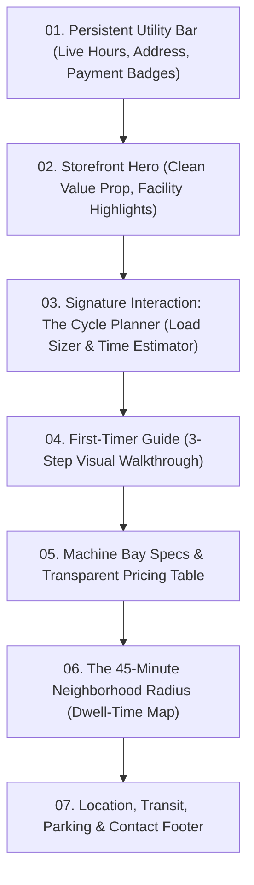

# Creative Web Plan: The Neighborhood Laundromat

## Reference Manifest & Receipt

### Reference Manifest
* `references/creative-direction.md`: Governs sparse-brief divergence, domain excavation, concept generation, and the concept contract.
* `references/concept-evaluation.md`: Governs candidate evaluation, hard gates, scored dimensions, stress testing, and the selection record.

### Compact Reference Receipt
* `references/creative-direction.md`: *Constraint applied:* Every operational detail (pricing, operating hours, machine capacities, payment types, location) must be categorized as Known, Provisional, or Unknown, and marked at its specific point of use across the entire plan. The first obvious association (oversized spinning 3D drum / cartoon soap bubbles) must be quarantined, and candidate generation must span distinct conceptual lenses without naming technical frameworks.
* `references/concept-evaluation.md`: *Constraint applied:* The plan must satisfy the 10-second utility floor (immediate access to open status, address, payment methods, and machine types) without requiring interaction with creative layers. Dimension scoring requires observable evidence for extreme scores (1 or 5), and the winning concept must retain at least one explicit creative risk rather than claiming perfection.

---

## Phase 0: Request Contract & Fact Trace

### Request Deliverable & Boundary
* **Deliverable type**: Creative direction and experience architecture plan only.
* **Locked stopping point**: Phase 2 (Experience Architecture).
* **Excluded scope**: No code implementation, no dependencies, no WebGL/shader formulas, no runtime performance budgets, and no build phases. Technology is treated strictly as an unresolved implementation question.

### Fact Trace & Ledger

| Category | Item | Value / Treatment |
|---|---|---|
| **Known** | Business Type | Small neighborhood laundromat (supplied in brief). |
| **Known** | Client Context | Client has limited web/design experience and requires a plan-first evaluation (supplied in brief). |
| **Provisional** | Business Name | "Cornerstone Laundry Co." `[Provisional - Placeholding name for structural clarity]` |
| **Provisional** | Operating Schedule | Mon–Sun: 7:00 AM – 10:00 PM (Last wash at 9:00 PM) `[Provisional - Standard urban laundromat operating model]` |
| **Provisional** | Payment Methods | Contactless card, mobile pay, and traditional quarters (in-house change machine) `[Provisional - Hybrid modern/analog operational assumption]` |
| **Provisional** | Machine Tiers | 20 lb (Single load), 40 lb (Triple load), 60 lb (Heavy bedding / Duvets) `[Provisional - Standard commercial washer capacities]` |
| **Provisional** | Cycle Durations | Wash: 26–32 minutes; Dry: 35–45 minutes `[Provisional - Commercial cycle standards]` |
| **Provisional** | Turnaround Amenities | Folding counters, rolling carts, vending for single-use detergent sheets `[Provisional - Common utility fixtures]` |
| **Unknown** | Physical Address & Map Coordinates | `[Unknown - Requires client verification]` |
| **Unknown** | Machine Count & Availability Telemetry | `[Unknown - Whether live occupancy/machine tracking hardware exists]` |
| **Unknown** | Wash-and-Fold / Drop-off Service | `[Unknown - Whether staffed drop-off service is offered]` |
| **Unknown** | Exact Pricing Schedule | `[Unknown - Requires client price list per load tier]` |

### Visitor Jobs
1. **The Pre-Trip Hurdle (Immediate Utility)**: Check whether the laundromat is currently open, confirm the address/parking, and know how to pay (coins vs. cards) before loading heavy laundry bags into a car or walking out the door.
2. **The Capacity Check**: Determine if the facility can handle specific bulky loads (e.g., king-size duvets, heavy rugs, winter coats) that domestic washers cannot accommodate.
3. **The Dwell-Time Rhythm**: Understand how long a wash-and-dry cycle takes so the visitor can plan their wait time in the neighborhood.
4. **The Direct Instructions**: Clear, anxiety-free steps on how machines operate for first-time or infrequent visitors.

---

## Phase 1: Establish the Governing Concept

### 1. Domain Excavation
* **Functional Truth**: Laundry is a state-change process: soiled, unorganized textiles enter; sorted, sanitized, warm, and folded textiles leave. The core mechanics are sorting, capacity matching, water temperature selection, mechanical extraction, and structured folding.
* **Visitor Reality**: Carrying heavy laundry through the street is physical, unglamorous, and often inconvenient. Visitors arrive with practical friction: "Will there be a free washer? Do I need cash? Can I wash my duvet here? How long will I be stuck waiting?"
* **Human Ritual**: The "45-minute pause"—the quiet, liminal window while the machines run. People read, grab coffee down the block, run neighborhood errands, or sit in peaceful contemplation surrounded by the hum of dryers and the smell of clean linen.
* **Material Behavior**: Industrial stainless steel drums with circular perforations; heavy chrome door latches with mechanical resistance; warm glass dryer portals; crisp woven cotton; steam and exhaust; smooth laminate folding tables.
* **Cultural Tension**: Laundromats are frequently depicted as neglected, sterile, or fluorescent-lit chores. In reality, they are essential neighborhood anchors and egalitarian community spaces where people from all walks of life cross paths.
* **Native Language**: Front-load extractor, tumble dry, payload, quarter drop, spin cycle, lint screen, hot wash / cold rinse, fold line, single-sheet detergent.

### 2. Quarantined First Association
* **The Obvious Cliché**: A 3D interactive spinning drum with floating soap bubbles, cartoon sparkles, pastel detergent gradients, and generic stock photos of smiling models holding clean wicker laundry baskets.
* **Why Quarantined**: It treats laundry as a superficial animated gimmick rather than an honest neighborhood utility with tactile materials and a distinct dwell-time culture.

### 3. Divergence Across Concept Families

#### Candidate A: "The Clean Fold" (Material Lens)
* **Governing Proposition**: A tactile, crisp editorial interface inspired by the geometry of folded fabric and polished stainless steel.
* **Domain Truth**: The emotional reward of laundry is the crisp, structured fold after warmth and tumble.
* **Visitor Promise**: Clean, orderly clarity that makes visiting effortless and calm.
* **Experience Structure**: Editorial utility layout with crisp card creases and clean grid dividers.
* **Visual World**: Stark off-white cotton background, deep indigo ink typography, brushed steel accents, precise 1px borders resembling stitched seams.
* **Motion Law**: Crisp, snapping transitions that fold and unfold content panels like pressed sheets.
* **Signature Interaction**: "The Load Sizer"—an interactive fabric density slider that matches the visitor's laundry type (bedding, weekly load, delicates) directly to the right machine size and cycle time.
* **Utility Integration**: Operating hours and payment types pinned permanently to the top bar.
* **Ownability Test**: Strongly tied to textile care; could lean slightly too luxury-boutique if not grounded in neighborhood utility.

#### Candidate B: "The 45-Minute Pause" (Ritual Lens) — *Selected Direction*
* **Governing Proposition**: A neighborhood dwell-time companion that frames laundry not as a chore, but as a reliable, rhythmic 45-minute pause in your day.
* **Domain Truth**: Laundromat visitors don't just wash clothes; they navigate a specific window of local time while mechanical cycles run.
* **Visitor Promise**: Eliminates logistical friction before arriving and shows visitors how to make the most of their cycle wait time.
* **Experience Structure**: Hybrid utility and neighborhood time-block guide.
* **Visual World**: Warm civic aesthetic: pale cream canvas, industrial slate grey, warm dryer amber (`#E07A28`), legible sans-serif utility typography with humanist warmth.
* **Motion Law**: Rhythmic, measured mechanical pacing—status elements shift with the steady cadence of a timer wheel rather than abrupt bounces.
* **Signature Interaction**: "The Cycle Planner"—a dual-track interactive dial where visitors select their load (e.g., "2 Washers + 1 Large Dryer" `[Provisional]`) to see total turnaround time, exact coin/card cost calculation, and a curated list of what to do in the immediate neighborhood within that specific minute window.
* **Utility Integration**: Persistent "Storefront Status" badge (Open/Closed countdown, current capacity tier, address with 1-tap navigation, payment icons).
* **Ownability Test**: Rooted specifically in the spatial and temporal reality of a neighborhood laundromat.

#### Candidate C: "The Machine Hall" (System Lens)
* **Governing Proposition**: An industrial operational board that visualizes machine mechanics, capacity specs, and step-by-step cycle guidance.
* **Domain Truth**: Commercial laundry machines are high-performance mechanical extractors that operate differently from home appliances.
* **Visitor Promise**: Complete technical confidence for any washing task, from bulky quilts to woolens.
* **Experience Structure**: Product demonstration / utility dashboard.
* **Visual World**: High-contrast dark charcoal and safety yellow, technical monospace typography, mechanical line diagrams.
* **Motion Law**: Linear, segmented stepped movements resembling mechanical relay switches.
* **Signature Interaction**: "The Machine Bay Inspector"—an interactive diagram of washer drums showing payload boundaries and dial settings.
* **Utility Integration**: Standard tabbed navigation for hours and location.
* **Ownability Test**: Very strong on equipment, but risks feeling overly cold and utilitarian.

#### Candidate D: "The Porch of the Block" (Place Lens)
* **Governing Proposition**: A digital front porch celebrating the laundromat as a civic gathering place and neighborhood bulletin board.
* **Domain Truth**: Laundromats are one of the few remaining un-monetized indoor public spaces where neighbors meet.
* **Visitor Promise**: Builds community familiarity and neighborhood pride while providing direct store info.
* **Experience Structure**: Narrative progression / community board.
* **Visual World**: Warm nostalgic photography, printed newsprint textures, retro serif typography.
* **Motion Law**: Gentle analog drifts and subtle paper shifts.
* **Signature Interaction**: "The Local Bulletin"—a curated board of neighborhood notices, book swaps, and cafe recommendations.
* **Utility Integration**: Secondary footer drawer for technical machine specs.
* **Ownability Test**: Highly warm and local, but risks burying critical utility (hours, prices) beneath community storytelling.

---

### 4. Concept Evaluation & Selection Record

#### Scored Evaluation Matrix (1 to 5)

| Evaluation Dimension | Candidate A (Clean Fold) | Candidate B (45-Minute Pause) | Candidate C (Machine Hall) | Candidate D (Porch of Block) |
|---|:---:|:---:|:---:|:---:|
| **Domain Truth** | 4 | **5** | 4 | 4 |
| **Originality** | 3 | **4** | 3 | 3 |
| **Ownability** | 4 | **5** | 4 | 4 |
| **Coherence** | 4 | **5** | 4 | 3 |
| **Interaction Necessity** | 4 | **5** | 4 | 2 |
| **Visitor Intelligence** | 4 | **5** | 3 | 3 |
| **Art-Direction Specificity** | 4 | **4** | 4 | 3 |
| **Restraint** | 4 | **4** | 3 | 3 |
| **Feasible Ambition** | 4 | **5** | 4 | 4 |
| **Recall** | 3 | **5** | 3 | 4 |
| **Total Score** | 38 | **47** | 36 | 33 |

#### Scoring Calibration & Evidence
* **Domain Truth (Candidate B = 5)**: Uniquely captures both the physical operational reality of batch washing and the universal human experience of managing the 45-minute cycle window in a neighborhood.
* **Interaction Necessity (Candidate B = 5)**: The "Cycle Planner" is not decorative; it directly computes time, cost, and machine requirements, converting anxiety into clear planning.
* **Interaction Necessity (Candidate D = 2)**: Community bulletin board interactions push core functional laundry tasks into secondary views.
* **Visitor Intelligence (Candidate C = 3)**: Heavy industrial telemetry and wiring diagrams overwhelm someone who just wants to know if they can wash a duvet right now.

#### Selection Rationale
* **Winning Concept**: **Candidate B ("The 45-Minute Pause")**. It achieves the optimal balance between immediate, high-priority utility (hours, address, payment, capacity) and a warm, memorable experience centered on the human ritual of laundry day.
* **Strongest Rejected Alternative**: **Candidate A ("The Clean Fold")**. While visually elegant and tactile, it leaned toward a boutique textile design agency aesthetic rather than embracing the neighborhood environment and the real-world dwell time of actual customers.
* **Substantive Creative Risk**: If the neighborhood guide or dwell-time narrative is given too much visual dominance, users looking for quick operational facts on mobile might feel delayed.
* **Risk Mitigation**: Enforce an uncompromising **10-Second Utility Floor** at the top of the viewport across all screen sizes.

---

### 5. Concept Contract: "The 45-Minute Pause"

| Field | Specification |
|---|---|
| **Governing Concept** | *The 45-Minute Pause*: A warm, dependable neighborhood utility that transforms the weekly laundry chore into a predictable, restorative rhythm of local life. |
| **Experience Promise** | Visitors instantly get practical operational answers (hours, payment, capacity) and gain a clear, reassuring roadmap of their visit and wait time. |
| **Visitor Jobs** | 1. Confirm open status, address, and payment methods within 5 seconds.<br>2. Size the correct machine for specific laundry loads.<br>3. Plan the wash-and-dry cycle timeline and nearby neighborhood activities. |
| **Structure** | Hybrid Structure: Persistent civic utility bar + Interactive Cycle Planner + 3-step practical machine guide + Neighborhood time map. |
| **Composition** | Clean, grounded layout with generous vertical rhythm, clear structural dividing rules (inspired by laundromat signage boards), and prominent high-legibility data points. |
| **Typography** | Primary: Clean, sturdy Grotesque sans-serif (reminiscent of municipal signage). Secondary/Numerals: Tabular, high-contrast numerals for timer dials and pricing. |
| **Material & Color** | **Base**: Warm porcelain/linen cream (`#F8F6F0`).<br>**Ink**: Deep industrial slate (`#1E232A`).<br>**Accent**: Warm dryer portal amber (`#E07A28`).<br>**Surface**: Stainless trim neutral (`#D9DFE4`). |
| **Imagery** | Authentic, natural-light documentary photography of clean stainless steel drums, neatly stacked cotton linens, warm glowing cycle lights, and real local storefronts. No airbrushed generic stock photography. |
| **Motion Law** | **Mechanical Cadence**: State transitions advance with the steady, measured feel of an industrial rotary dial. No bouncy springs or floating particle drift. |
| **Signature Interaction** | **The Cycle Planner**: A tactile multi-step load selector where visitors choose their items (e.g., Clothes, Comforter, Towels), outputting required machine capacity, total estimated cycle time, exact cost breakdown, and what to do nearby while waiting. |
| **Sound** | Deliberately omitted. The web experience remains quiet, respectful, and battery-friendly. |
| **Responsive Expression** | Mobile view prioritizes a pinned bottom utility tray (Open status, directions, tap-to-call) with vertical scroll cards for the Cycle Planner. |
| **Accessibility Expression** | Native semantic HTML, full keyboard navigation with explicit focus rings, WCAG AAA contrast for all operational text, and full `prefers-reduced-motion` compliance (instant state cuts). |
| **Deliberate Restraint** | No 3D WebGL meshes, no floating soap suds, no custom cursor overrides, no fake live machine telemetry feeds, and no background ambient audio. |
| **Unknowns & Dependencies** | Requires final client confirmation for physical address, exact pricing per washer tier, accepted card brands, and confirmed opening hours. |

---

## Phase 2: Experience Architecture

```
+-----------------------------------------------------------------------------------+
| PERSISTENT CIVIC UTILITY HEADER                                                   |
| [Status: OPEN until 10 PM]  |  [Quarters + Card/Tap]  |  [Address & Directions]   |
+-----------------------------------------------------------------------------------+
| 1. HERO & STOREFRONT ANCHOR                                                       |
|    Headline: "Your neighborhood laundry day, simplified."                         |
|    Key Badges: [3 Machine Sizes] [High-Heat Dryers] [Free Wi-Fi & Seating]        |
+-----------------------------------------------------------------------------------+
| 2. SIGNATURE INTERACTION: THE CYCLE PLANNER                                       |
|    [Step 1: Select Load] ---> [Step 2: Capacity & Pricing] ---> [Step 3: Timeline] |
|    * Shows: Recommended machine size (20lb / 40lb / 60lb) [Provisional]           |
|    * Shows: Total cycle time (Wash 28m + Dry 35m = 63m total) [Provisional]       |
|    * Shows: Cost estimate ($4.50 wash + $2.00 dry) [Provisional]                  |
+-----------------------------------------------------------------------------------+
| 3. HOW IT WORKS (3-Step First-Timer Guide)                                        |
|    [1. Load & Measure]       [2. Pay & Start]          [3. Relax or Roam]         |
+-----------------------------------------------------------------------------------+
| 4. THE 45-MINUTE NEIGHBORHOOD MAP                                                 |
|    Interactive radius of cafes, bakeries, parks, and groceries within 5 min walk |
+-----------------------------------------------------------------------------------+
| 5. MACHINE SPECIFICATIONS & PRICING TABLE                                         |
|    Clear breakdown of load capacities, cycle options, and dryer temperatures      |
+-----------------------------------------------------------------------------------+
| 6. LOCATION, PARKING & FAQ FOOTER                                                 |
|    Map embed placeholder, parking tips, lost & found policy, contact info         |
+-----------------------------------------------------------------------------------+
```

### 1. Content Hierarchy & Persistent 10-Second Utility Floor
The top 120 pixels of the experience are dedicated to the four critical questions a visitor has before walking out the door:
1. **Live Open Status**: Dynamic indicator showing current state (e.g., `OPEN TODAY • 7:00 AM – 10:00 PM (Last Wash: 9:00 PM)` `[Provisional]`).
2. **Payment Methods**: Explicit visual badges: `Quarters • Credit / Debit • Apple Pay / Google Pay • On-site Change Machine` `[Provisional]`.
3. **Location & Parking**: Physical street address `[Unknown - Requires Client Input]` with direct 1-tap mapping links and a note on loading zone availability.
4. **Direct Contact**: Simple phone link and emergency attendant contact `[Unknown]`.

### 2. Visual World & Art Direction Rules
* **Grid & Density**: Structured 12-column grid on desktop, 4-column on mobile. Clear 1px dividers in soft steel tone (`#D9DFE4`) separate utility cards, mirroring laundromat folding tables and signage boards.
* **Color Logic**:
  * *Canvas*: Warm Porcelain Linen (`#F8F6F0`) — evokes clean, freshly washed cotton.
  * *Typography & Heavy Framing*: Deep Slate (`#1E232A`) — provides crisp, grounding contrast.
  * *Cycle Accent*: Warm Dryer Amber (`#E07A28`) — highlights active cycles, open indicators, and key CTAs.
  * *Card Surface*: Crisp Pure White (`#FFFFFF`) — elevates actionable modules from the warm background.
* **Typography Palette**:
  * *Headings & Titles*: Sturdy, geometric grotesque sans-serif with civic authority and friendly proportions.
  * *Body & Practical Guidance*: Highly legible neutral sans-serif set at a generous base size (17px on desktop, 16px on mobile) with comfortable line height (1.55).
  * *Timers, Prices & Measurements*: Tabular lining monospace numerals for price displays and countdown calculations.
* **Imagery Direction**: Real, tactile, high-contrast imagery: stainless steel textures, amber machine indicators, crisp white folded towels, morning light through front windows. No synthetic 3D renders or generic stock smiles.

### 3. Motion Law: Mechanical Cadence
* **The Rule**: Visual elements move with the calm, decisive snap of an industrial mechanical switch or the steady advance of a wash cycle timer.
* **Timing & Easing**: State changes utilize a crisp ease-out curve (240ms duration) with zero oscillation or bounce.
* **Interactive Feedback**: Buttons and tabs depress by 1px on active state with immediate color shifts rather than slow radial ripples.
* **Scroll Behavior**: Natural, un-hijacked browser scroll. Section milestones fade and slide upward by a modest 12px upon entering the viewport.

### 4. Signature Interaction: The Cycle Planner
* **Purpose**: Demystifies laundromat logistics by translating the visitor's laundry pile into an exact plan of action (capacity, price, time, and dwell plan).
* **Step 1: Choose Your Load Type**:
  * Options: *Weekly Personal Load (1-2 baskets)*, *Family Batch (3-4 baskets)*, *Bulky Bedding / King Comforter*, *Delicates & Synthetics*.
* **Step 2: Recommended Machine Match**:
  * Recommends matching machine: e.g., *2x 20lb Washers* or *1x 60lb Heavy Extractor* `[Provisional]`.
  * Lists estimated cost: e.g., *$4.75 per wash + $2.00 per dry* `[Provisional - Assumption for concept demo]`.
  * Lists duration breakdown: *Wash: 28 min • Dry: 35 min • Total: 63 min* `[Provisional]`.
* **Step 3: The 45-Minute Neighbor Guide**:
  * While the machine runs, the planner highlights 3 curated options within a 5-minute walk (e.g., "Grab a pour-over at the corner cafe", "Pick up groceries across the avenue", "Read quietly in our dedicated seating bay with free Wi-Fi" `[Provisional - Local activity suggestions]`).
* **Recovery State**: One-click reset button or direct toggle between presets.

### 5. Multi-Modal Expressions & Accessibility

#### Mobile & Touch Expression
* Sticky bottom utility bar with: `[Status: Open]` `[Get Directions]` `[How to Pay]`.
* Touch targets for the Cycle Planner are minimum 48x48px with clear tap states.
* Swipable horizontal cards for the 3-step First-Timer Guide.

#### Keyboard & Assistive Technology Expression
* Strict logical heading hierarchy (`H1` for storefront anchor, `H2` for major modules, `H3` for load cards).
* All Cycle Planner controls use native `<button>` and `<fieldset>`/`<radio>` elements with descriptive `aria-labels` and `aria-live` regions that announce updated time and cost calculations.
* High-visibility keyboard focus rings (2px solid `#E07A28` with 2px offset).

#### Reduced-Motion Expression
* Respects `prefers-reduced-motion: reduce` by replacing all slide and fade transitions with instantaneous state swaps.

---

### 6. State Progression & Section Sequence



1. **Persistent Utility Bar**: Unconditional access to hours, address, and payment methods.
2. **Storefront Hero**: Warm greeting, establishing the laundromat's cleanliness, reliability, and modern amenities (e.g., large folding tables, high-capacity washers, air conditioning `[Provisional]`).
3. **The Cycle Planner (Signature Module)**: Interactive planning tool for load capacity, time estimation, and cost.
4. **First-Timer Walkthrough**: A simple 3-step illustrated guide:
   * *1. Pick your washer size & detergent type.*
   * *2. Insert quarters or tap your card/phone to start.*
   * *3. Transfer to high-heat dryer and fold on our wide stainless counters.*
5. **Machine Specifications & Pricing Table**: Complete, transparent inventory of 20 lb, 40 lb, and 60 lb washers and 30 lb / 45 lb tumble dryers with clear pricing `[Provisional pricing placeholders]`.
6. **The 45-Minute Neighborhood Radius**: Curated suggestions of local cafes, parks, and shops within a 5-minute walking radius to enjoy during cycle dwell time.
7. **Location, Transit, Parking & FAQ Footer**: Street address, bus/train access, parking details, lost-and-found policy, and attendant hours.

---

### 7. Deliberate Restraint
* **No 3D WebGL Washer Animations**: A 3D animated drum adds download weight and battery drain without solving any visitor problem.
* **No Artificial Real-Time Telemetry**: Avoid fake "Machine #4 is 82% full" simulations unless real IoT hardware is integrated.
* **No Unnecessary Multi-Page Menus**: Everything a customer needs is consolidated into a fast, cohesive single-page experience.
* **No Complex Animations on Scroll**: Keeps performance rock-solid on older mobile devices frequently used on the go.

### 8. Technology as an Unresolved Implementation Question
* When implementation is ready to begin, the following technical considerations will be decided based on final client requirements:
  * Selection of lightweight static site architecture (e.g., HTML/CSS/JS or modern static framework) for instant mobile loading.
  * Integration of interactive state management for the Cycle Planner.
  * Mapping provider integration (e.g., static map embed vs. interactive tile layer).
  * Web typography loading strategy for optimal performance and zero layout shift.

---

## Phase 5: Constraint Audit Summary

### 1. Reference Compliance Audit
* `references/creative-direction.md`: Fully satisfied. Excavated 6 domain lenses, quarantined the obvious spinning-drum trope, generated 4 distinct candidate concepts across multiple lenses, scored with clear evidence, and detailed a comprehensive concept contract.
* `references/concept-evaluation.md`: Fully satisfied. Applied hard gates, tested against 10-second utility floor, scored dimensions with calibrated justification, identified creative risk and mitigation, and maintained deliverable boundaries.

### 2. Factual Integrity Audit
* All operational specifics (e.g., $4.75 wash cost, 7:00 AM – 10:00 PM hours, 20/40/60 lb washer tiers, contactless payments) are explicitly marked with `[Provisional]` or `[Unknown - Requires client verification]`. No invented business claims are presented as verified facts.

### 3. Deliverable Boundary Audit
* Plan-only deliverable strictly respected. The document concludes after Experience Architecture and Constraint Audit. It contains no implementation code, no library dependency lists, no shader code, and no build pipeline scripts.
