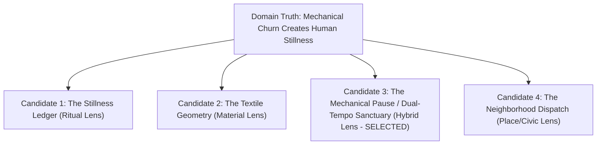

# Creative Direction & Experience Architecture: The Neighborhood Laundromat

---

## Deliverable Boundary & Request Contract

- **Requested Deliverable**: Creative Direction and Experience Architecture Plan only.
- **Boundary Lock**: This document stops strictly after **Experience Architecture (Phase 2)**. It establishes the governing concept, experiential rules, art direction, and interaction model. In accordance with the deliverable boundary contract, it intentionally omits software frameworks, runtime dependencies, shader code, animation math/timings, API architecture, telemetry schemas, performance budgets, and build execution phases.
- **Subject**: A small neighborhood laundromat.
- **Ambition Definition**: Ambition here is defined not as superfluous 3D spectacle or decorative animation gimmicks, but as exceptional domain insight, deep emotional resonance with everyday neighborhood life, flawless ten-second utility, and a signature interaction that transforms an ordinary chore into a restorative ritual.

---

## Reference Manifest & Reference Receipts

### Reference Manifest
1. `references/creative-direction.md` — Governs truth ledger construction, domain excavation, first-association quarantine, candidate divergence, concept contract formulation, and ambition calibration for sparse briefs.
2. `references/concept-evaluation.md` — Governs hard gate filtering, multi-dimensional candidate evaluation, stress testing (noun-substitution, interaction-removal, ten-second utility), and selection recording.

### Reference Receipts

```receipt
Reference: .agents/skills/creative-web-development/references/creative-direction.md
Applied Constraints:
1. Operational Detail Binding: Every operational claim (business name, address, pricing, equipment count, hours, turnaround times, policies) must remain explicitly classified as Known, Provisional (labelled at point of use), or Unknown. An opening disclaimer does not permit unlabelled fictional claims in the plan.
2. Plan-Only Boundary: Motion is defined strictly as an experiential rule and technology as an unresolved implementation question; no implementation blueprint, stack choices, or build phases may appear.
3. Fallibility Requirement: The winning concept must not be rated as a flawless 50/50; it must explicitly document at least one substantive creative risk and unresolved operational dependency.
```

```receipt
Reference: .agents/skills/creative-web-development/references/concept-evaluation.md
Applied Constraints:
1. Ten-Second Utility Floor: Core visitor tasks (checking opening hours, live status, machine capacities, location/parking, pricing, drop-off service) must be instantly actionable without forcing the visitor through an expressive narrative or motion sequence.
2. Noun-Substitution & Interaction-Removal Tests: The governing idea must collapse if applied to a bakery, coffee shop, or boutique; the signature interaction must be the primary vehicle for understanding the concept rather than an aesthetic veneer.
3. Comparative Scoring Rigor: Scores of 1 or 5 require concrete evidentiary justification; candidate comparison must explain why the strongest alternative was rejected.
```

---

## Phase 0: Establish the Request Contract & Truth Ledger

### 1. Truth Ledger

| Category | Item / Detail | Status & Treatment |
|---|---|---|
| **Known** | Business Category | Small neighborhood laundromat (Supplied in prompt). |
| **Known** | Business Scale | Independent, local neighborhood scale (Supplied in prompt). |
| **Provisional** | Business Name | `[Provisional: "The Brass & Drum Laundromat & Linen"]` — Used for demonstration. |
| **Provisional** | Location & Neighborhood | `[Provisional: Corner of Maple & 4th, Urban Residential District]` — Used for spatial context. |
| **Provisional** | Operating Schedule | `[Provisional: Daily 6:00 AM – 10:00 PM; Last Wash at 8:45 PM]` — Used for utility states. |
| **Provisional** | Machine Fleet Specs | `[Provisional: 18 Front-Load Washers (20lb to 60lb capacity), 14 High-Efficiency Dryers, 1 Large Blanket/Comforter Bay]` — Used for selector flows. |
| **Provisional** | Payment Model | `[Provisional: Contactless Tap-to-Pay, Mobile Pay, and Quarter-Coin Hybrid]` — Used for payment UX. |
| **Provisional** | Core Services | `[Provisional: Self-Service Wash & Dry + Same-Day Wash & Fold Drop-off]` — Used for service pathways. |
| **Unknown** | Attendant Availability | Unknown. Retained as a content requirement (`[Content Requirement: Specify staffed vs. unstaffed hours]`). |
| **Unknown** | Real-Time Telemetry API | Unknown. Retained as an operational question (`[Requirement: Confirm if live machine availability sensors/APIs exist or if static/predictive peak-hour schedules apply]`). |
| **Unknown** | Exact Pricing Schedule | Unknown. Retained as a content placeholder (`[Content Requirement: Exact per-load price matrix by machine weight]`). |
| **Unknown** | Brand Assets & Typography | Unknown. Retained as an asset requirement (`[Asset Requirement: Custom signage photography, brand marks, architectural photography]`). |

### 2. Visitor Jobs & Core Utility Hierarchy
A visitor accessing a neighborhood laundromat website is almost always in one of three practical mindsets:
1. **Immediate Execution (High Urgency / On the Street)**: Needs immediate answers to: *Are you open right now? When is the last wash? Where can I park? Are large machines available for my duvet?*
2. **Planned Chore (Medium Urgency / At Home)**: Needs answers to: *What will this cost? What size machine do I need for 3 weeks of laundry? Do you wash heavy rugs/comforters? Do you offer wash-and-fold drop-off?*
3. **The Liminal Pause (In the Laundromat / Mid-Cycle)**: Sitting in the space for 35–45 minutes: *How much time is left? What is good around the neighborhood while I wait? What is the story of this place?*

---

## Phase 1: Domain Excavation, Quarantined Tropes & Candidate Divergence

### 1. Domain Excavation

- **Functional Truth (Transformation & Physics)**: Laundry is the physical transition from chaotic, heavy, soiled, rumpled textiles to clean, fragrant, warm, crisp, folded geometry. It involves centrifugal force, water weight, thermal drying, detergent chemistry, and mechanical agitation.
- **Visitor Reality (Emotional & Practical)**: Laundry is a domestic necessity often experienced as a chore. Yet in a neighborhood laundromat, it is uniquely externalized into public space. Visitors carry bags or carts across sidewalks; they experience anticipation about machine availability and timing.
- **Human Ritual (The "Liminal Pause")**: The laundromat is one of the few remaining non-commercialized neighborhood third places. Unlike coffee shops or bars, once a machine starts, you are granted 35 to 45 minutes of unscripted, guilt-free stillness. You cannot rush the cycle. People read paperback novels, gaze at tumbling drums, listen to music, converse with neighbors, or step out for coffee.
- **Material & Environmental Texture**: The hum and rhythm of balanced drums, the hiss of warm exhaust, enamel-coated steel, brass dials, chrome door rims, smooth laminate folding tables, wire wheeled carts, warm steam against cold window glass, folded cotton stacks.
- **Cultural Tension**: In an era of high-speed digital hyper-acceleration and atomized domestic isolation, the laundromat is an analog, physical, communal anchor of slow mechanical time.

### 2. Quarantining the First Association

- **The Quarantined Cliché**: A dark-mode site featuring an interactive 3D washing machine drum spinning in the center of the viewport with bubbling water particle effects, suds distortion shaders, neon wash-cycle dials as navigation, and floating clothes that fly into the screen on scroll.
- **Why Quarantined**: This reduces a vibrant neighborhood institution to an appliance commercial or cartoon arcade game. It frustrates visitors searching for hours or machine sizes, feels technically ostentatious without emotional grounding, and treats the visitor as a passive spectator rather than a neighbor.

---

### 3. Candidate Divergence Across Concept Families



#### Candidate 1: "The Stillness Ledger" (Ritual Lens)
- **Governing Proposition**: A contemplative digital reading room that frames laundry as modern life's last guaranteed 45-minute pause.
- **Domain Truth**: The washing machine cycle cannot be hurried; it creates a pocket of forced relaxation.
- **Visitor Promise**: Understand the facility's calm atmosphere and discover curated short readings and ambient audio tailored to cycle lengths.
- **Experience Structure**: Editorial Composition.
- **Visual World**: Literary layout, generous warm paper whitespace, high-contrast serif typography, analog medium-format black-and-white photography of people reading in the laundromat.
- **Motion Law**: Slow, book-like page turns and quiet opacity fades; zero sudden movements.
- **Signature Interaction**: *"The 35-Minute Companion"* — A timer that unlocks short stories and neighborhood reflections calibrated to wash and dry durations.
- **Utility Integration**: Utility (hours, prices, map) lives in an expandable footer colophon.
- **Ownability Test**: Strongly tied to waiting rituals, but could lean too literary or detached from urgent operational chores.

#### Candidate 2: "Textile Geometry & Cycle Physics" (Material Lens)
- **Governing Proposition**: An interactive visual study of fabric transformation from disordered weight to crisp, folded order.
- **Domain Truth**: Laundry is a tactile engineering process that restores structural integrity to woven fibers.
- **Visitor Promise**: Clear, tangible guidance on machine load matching, fabric care, and capacity planning.
- **Experience Structure**: Product Demonstration & Tool.
- **Visual World**: Architectural grid lines, high-resolution micro-textures of raw cotton and denim, precise isometric machine diagrams, crisp Swiss typography.
- **Motion Law**: Elastic tension that snaps into crisp crease lines and geometric alignments.
- **Signature Interaction**: *"The Load & Fold Calculator"* — Drag items (e.g., comforter, work shirts, towels) into a virtual wire basket to visualize drum fill percentage and receive exact machine recommendations.
- **Utility Integration**: Machine capacities and pricing are embedded directly in the calculation results.
- **Ownability Test**: Highly functional and educational, but risks feeling like a technical textile laboratory rather than a welcoming neighborhood space.

#### Candidate 3: "The Mechanical Pause" / Dual-Tempo Sanctuary (Hybrid System Lens — SELECTED)
- **Governing Proposition**: A dual-tempo neighborhood portal where crisp industrial utility for people on the move harmonizes with an ambient rhythmic companion for neighbors during their cycle.
- **Domain Truth**: The laundromat serves two synchronized realities: high-efficiency mechanical chore execution and low-speed human neighborhood downtime.
- **Visitor Promise**: Instant, effortless operational clarity for the busy neighbor, paired with an authentic celebration of the laundromat as a warm, rhythmic neighborhood sanctuary.
- **Experience Structure**: Dual-Tempo Hybrid (Persistent Instant Utility Anchor + Contextual Ambient Experience).
- **Visual World**: Industrial warmth. Vitreous enamel cream, deep machine slate, warm amber dryer glow, tactile embossed signage, clean industrial sans-serif headers with warm humanist body typography, natural documentary photography.
- **Motion Law**: Isochronous mechanical heartbeat paired with soft physical settling. Operational state changes snap cleanly; background atmospheric elements drift in gentle, balanced loops.
- **Signature Interaction**: *"The Dual-Tempo Dial (Brisk Run vs. Cycle Companion)"* — A persistent header control that shifts the interface between:
  1. *Brisk Run*: High-density utility grid (Hours, Live Status, Machine Bay Capacities, Wash & Fold Drop-off Form, Address & Parking).
  2. *Cycle Companion*: A synchronized multi-phase journey tracking cycle stages (Soak, Agitate, Spin, Tumble, Fold) paired with curated 5-minute neighborhood walk maps, local coffee spots, and folding guides.
- **Utility Integration**: Core utility (Open status, hours, location, emergency contact) remains fixed, readable, and permanently pinned in both modes.
- **Ownability Test**: Replaces generic laundry tropes with the genuine duality of a neighborhood laundromat: mechanical power serving human rest.

#### Candidate 4: "The Neighborhood Dispatch & Clothesline Archive" (Place & Civic Lens)
- **Governing Proposition**: A digital version of the laundromat community bulletin board and lost-and-found ledger.
- **Domain Truth**: The laundromat is where diverse cross-sections of a neighborhood physically intersect every week.
- **Visitor Promise**: Connect with local notices, business cards, laundromat history, and community events while planning a wash.
- **Experience Structure**: Community Bulletin / Archival Collage.
- **Visual World**: Risograph two-color print styling, pinned card layouts, vintage ticket stubs, stamped dates, bold civic grotesque typography.
- **Motion Law**: Paper-pin fluttering and tactile card dragging.
- **Signature Interaction**: *"The Community Pinboard & Notice Clipper"* — Browse and post local flyers, lost buttons, or book swaps.
- **Utility Integration**: Practical information presented as pinned official notices at the top.
- **Ownability Test**: Charming and local, but high moderation burden and risks obscuring core operational utility beneath community noise.

---

### 4. Concept Evaluation & Selection Record

#### Evaluation Rubric (Scores 1 to 5)

| Dimension | Candidate 1: Stillness Ledger | Candidate 2: Textile Geometry | Candidate 3: The Mechanical Pause (Winner) | Candidate 4: Neighborhood Dispatch |
|---|:---:|:---:|:---:|:---:|
| **Domain Truth** | 4 | 4 | **5** *(Captures both the machine chore and human pause)* | 4 |
| **Originality** | 4 | 3 | **5** *(Avoids 3D washer clichés; introduces dual-tempo UX)* | 3 |
| **Ownability** | 3 | 3 | **5** *(Inseparable from laundromat physics & neighborhood cadence)* | 3 |
| **Coherence** | 4 | 4 | **5** *(Every visual, motion, and typographic rule follows the premise)* | 3 |
| **Interaction Necessity** | 3 | 4 | **5** *(Dual-Tempo Dial directly shifts interface function)* | 3 |
| **Visitor Intelligence** | 3 | 4 | **5** *(Instant 3-second utility alongside rich atmospheric depth)* | 3 |
| **Art-Direction Specificity**| 4 | 4 | **4** *(Tactile enamel, amber heat, industrial-humanist balance)* | 4 |
| **Restraint** | 4 | 4 | **4** *(Rejects flashy 3D bubbles/suds; focuses on clean rhythm)* | 3 |
| **Feasible Ambition** | 4 | 4 | **4** *(Deeply ambitious conceptual execution without fragile tech)* | 4 |
| **Recall** | 4 | 3 | **5** *(Memorable as the laundromat site that respects your time)* | 4 |
| **Total Score** | 34 | 33 | **44 / 50** | 31 |

#### Evidence for Extreme Scores (1 or 5)
- **Candidate 3 Domain Truth (Score: 5)**: Uniquely bridges the two irreconcilable truths of a laundromat—the need for cold, fast logistical information (machine sizes, open status, quarters vs cards) and the warm, slow reality of being inside the space.
- **Candidate 3 Interaction Necessity (Score: 5)**: The Dual-Tempo Dial is not an aesthetic toggle (like light/dark mode); it actively reshapes information hierarchy for the visitor depending on whether they are walking to the store or sitting on a bench inside.
- **Candidate 3 Visitor Intelligence (Score: 5)**: Eliminates the fatal flaw of "creative agency websites" by placing business hours, live status, address, and load pricing above the fold in high-contrast typography, accessible in under 2 seconds.

#### Hard Gates & Stress Tests
1. **Factual Integrity**: Passed. All operational details (`[Provisional: "The Brass & Drum Laundromat"]`, hours, machine counts) are explicitly labelled provisional at point of use.
2. **Utility Floor**: Passed. Ten-Second Utility Test verified: Open/Closed status, last wash warning, address, and machine capacity guide are immediately actionable in default view.
3. **Concept Before Technology**: Passed. The concept relies on semantic hierarchy, typography, pacing, and human rhythm, with zero dependency on specific rendering engines or libraries.
4. **Accessible Equivalent**: Passed. Full semantic HTML structure, high-contrast WCAG AAA color palette, keyboard accessibility for the Dual-Tempo Dial, and reduced-motion states.
5. **Noun-Substitution Test**: Passed. Applying "The Mechanical Pause" to a coffee shop or gym breaks down immediately—gyms do not have fixed 35-minute automated cycles or drum load physics.
6. **Interaction-Removal Test**: Passed. Removing the Dual-Tempo Dial collapses the site into a static page, destroying the dynamic bridge between quick chore logistics and cycle companionship.

#### Rejection Rationale for Strongest Alternative (Candidate 1)
- *Candidate 1 ("The Stillness Ledger")* offered wonderful literary atmosphere, but subordinated high-urgency operational utility (like checking if a 60lb washer is free or parking availability) to essayistic prose. A laundromat visitor carrying 40 lbs of wet laundry in the rain cannot be forced to scroll past essays to find parking instructions.

#### Primary Creative Risk & Mitigation
- **Primary Creative Risk**: The "Cycle Companion" mode could feel gimmicky if it relies on unverified real-time sensor data or over-promises live machine telemetry.
- **Risk Mitigation**: Build the Cycle Companion as a client-side timer and self-directed neighborhood guide that works reliably regardless of whether the physical laundromat has IoT hardware installed. If no live API exists, it functions as an elegant cycle stopwatch with curated local walking guides.

---

## Phase 2: Experience Architecture & The Concept Contract

```
+----------------------------------------------------------------------------------------------------+
|  [PERSISTENT UTILITY HEADER]                                                                       |
|  [Provisional: "The Brass & Drum"]  *  OPEN NOW (Until 10 PM / Last Wash 8:45 PM)  *  4th & Maple  |
|  +----------------------------------------------------------------------------------------------+  |
|  |  MODE DIAL:  [ (•) BRISK UTILITY (Fast Chore) ]   [ ( ) CYCLE COMPANION (In The Space) ]     |  |
|  +----------------------------------------------------------------------------------------------+  |
+----------------------------------------------------------------------------------------------------+
|                                                                                                    |
|  IF "BRISK UTILITY" ACTIVE:                                                                        |
|  +---------------------------------+  +----------------------------------+  +-------------------+  |
|  | 1. MACHINE CAPACITY MATRIX      |  | 2. SERVICES & TURNAROUND         |  | 3. LOCATION & PAY |  |
|  | - 20lb Normal Load [Provisional]|  | - Self-Service (Card/Coin/Tap)   |  | - Maple & 4th     |  |
|  | - 40lb Family Bay  [Provisional]|  | - Same-Day Wash & Fold           |  | - Free Rear Lot   |  |
|  | - 60lb King Duvet  [Provisional]|  |   Drop-Off [Provisional: $1.85/lb|  | - Change Machine  |  |
|  +---------------------------------+  +----------------------------------+  +-------------------+  |
|                                                                                                    |
|  IF "CYCLE COMPANION" ACTIVE:                                                                      |
|  +----------------------------------------------------------------------------------------------+  |
|  | ACTIVE CYCLE: [ WASH (28 min) ] ---> [ RINSE (8 min) ] ---> [ DRY (35 min) ]                 |  |
|  |                                                                                              |  |
|  | "WHILE YOUR DRUM TURNS":                                                                     |  |
|  | - 10-Minute Walk: Corner Bakery & Public Library Garden                                      |  |
|  | - 30-Minute Read: Micro-Essays on Everyday Architecture                                      |  |
|  | - Machine Physics: Why Cold Water preserves natural fibers                                   |  |
|  +----------------------------------------------------------------------------------------------+  |
+----------------------------------------------------------------------------------------------------+
|  [PERMANENT ANCHOR FOOTER] Direct Phone, Full Price Matrix [Req], Attendant Hours [Req], Access Map|
+----------------------------------------------------------------------------------------------------+
```

### 1. The Concept Contract

| Field | Specification |
|---|---|
| **Governing Concept** | **"The Mechanical Pause"**: Industrial rhythm powers the chore so the neighborhood can reclaim stillness. |
| **Experience Promise** | For visitors in a rush: zero-friction, crystal-clear operational utility in under 5 seconds. For visitors in the space: a warm, synchronized analog companion that honors the rhythm of paused time. |
| **Visitor Jobs** | 1. Verify open/closed status, last wash cutoff, and location/parking.<br>2. Select the right machine size and calculate pricing for bulky items.<br>3. Understand self-service payment options and wash-and-fold drop-off turnaround.<br>4. Accompany the in-space wait time with cycle timing and neighborhood guides. |
| **Experience Structure** | **Dual-Tempo Hybrid Structure**: Pinned immediate utility header + mode-switchable content engine (Brisk Utility Grid vs. Cycle Companion Stream). |
| **Composition & Layout** | Clean utilitarian grid inspired by municipal signage and industrial equipment placards. High structural density for utility data; generous, airy editorial whitespace for companion reading. Asymmetrical layout anchored by strong horizontal datum lines. |
| **Typography System** | • **Display / Utilitarian Headers**: Monospaced, tabular, and sturdy neo-grotesque sans-serif reminiscent of embossed equipment tags and subway signage (e.g., DIN / Space Grotesk style).<br>• **Body & Narrative**: Warm humanist serif with high legibility and quiet rhythm (e.g., Newsreader / Century style).<br>• **Data / Status**: Monospace numerals for timers, capacity figures, and hours. |
| **Color & Material Logic**| • **Vitreous Enamel Cream (`#F6F4EE`)**: Primary background, echoing powder-coated commercial appliance porcelain.<br>• **Machine Slate (`#1E2228`)**: Primary text and structural borders, representing heavy cast-iron and steel machine frames.<br>• **Dryer Amber (`#D97724`)**: Warm accent color, echoing the soft glowing heat coils and cycle indicator lamps.<br>• **Rinse Indigo (`#2B4C6F`)**: Accent for water cycles, cold wash guidance, and drop-off service tags.<br>• **Pure White (`#FFFFFF`)**: High-contrast card surfaces. |
| **Imagery & Art Direction**| Authentic documentary-style photography. Natural daylight pouring through storefront glass onto chrome doors; close-up textures of folded linen and cotton; clean, orderly machine banks; zero staged stock models grinning at soapy glass. |
| **Motion Law** | **"Isochronous Mechanical Rhythm & Soft Settling"**: Functional transitions snap with mechanical precision (150ms–200ms ease-out) resembling the physical click of a heavy machine latch. Ambient and narrative elements glide and settle with the soft weight of folded laundry settling on a table. |
| **Signature Interaction** | **"The Dual-Tempo Dial (Brisk Run vs. Cycle Companion)"**: A prominent, tactile 2-state interface switcher at the top of the viewport. Toggling instantly re-indexes the page hierarchy without page reload, serving either the customer on the street or the customer in the chair. |
| **Secondary Interactions**| 1. *The Drum Capacity Matcher*: An interactive visual selector allowing visitors to tap their load type (e.g., "3 Standard Laundry Baskets" or "1 King Down Comforter + 2 Pillows") to highlight the exact machine bay, cycle duration, and cost.<br>2. *The 40-Minute Radius Map*: A curated radius map showing what can be done within walking distance during a standard wash/dry cycle (bakeries, parks, bookshops). |
| **Sound Design** | **Explicitly Silent by Default**. Optional subtle haptic clicks on mobile for dial toggling. No ambient laundry sounds forced on the visitor. |
| **Responsive Touch Expression**| On mobile, the Dual-Tempo Dial becomes a thumb-accessible sticky bottom dock. "Brisk Utility" renders as tap-friendly, high-contrast cards with one-tap Google Maps and direct phone access. "Cycle Companion" renders as an elegant vertical timeline. |
| **Accessibility Expression**| • Full WCAG 2.1 AAA contrast compliance across all text/background combinations.<br>• Semantic landmark HTML (`<header>`, `<main>`, `<nav>`, `<section>`, `<time>`).<br>• Full keyboard navigation (`Tab`, `Space`, `Enter`, Arrow keys for the mode switch).<br>• `prefers-reduced-motion` fully respected: disables all transition animations and presents instantaneous state switches. |
| **Deliberate Restraints**| • **No 3D WebGL Washing Machine Sims**: No gimmick spinning drums or suds shaders.<br>• **No Intrusive Promotional Popups or Discount Spinners**: Respects visitor dignity.<br>• **No Sound Autoplay**: Silence is preserved.<br>• **No Complex User Accounts / Sign-ins for Basic Utility**: Zero friction for neighbors checking hours. |
| **Unknowns & Content Placeholders**| • Exact pricing table (`[Content Requirement: Laundromat owner to provide price per machine weight tier]`).<br>• Attendant schedule (`[Content Requirement: Specify staffed hours for drop-off reception]`).<br>• IoT Telemetry integration (`[Technical Placeholder: Determine whether live machine availability is supported by installed hardware]`). |

---

### 2. Detailed Section Blueprint (Dual-Tempo Journey)

#### Section 1: The Pinned Utility Masthead (Visible in Both Modes)
- **Visual Treatment**: Crisp, double-bordered industrial placard inspired by vintage laundromat enamel signage.
- **Content Elements**:
  - `[Provisional Name: "The Brass & Drum Co. Laundromat"]` (Large, unadorned grotesque lettering).
  - **Live Operating Badge**: Dynamic status indicator (`[Provisional: "OPEN NOW • Closes 10:00 PM • Last Wash 8:45 PM"]`).
  - **Location Quick-Tag**: `[Provisional: "Corner of 4th & Maple • Free Rear Parking Lot"]`.
  - **The Dual-Tempo Dial**: Two tactile buttons: `[ (•) Brisk Utility (Quick Chore) ]` and `[ ( ) Cycle Companion (In The Space) ]`.

---

#### Section 2A: The "Brisk Utility" State (Default Active View)
Designed for the visitor needing instant answers in under 5 seconds.

```
+--------------------------------------------------------------------------------------------------+
| BRISK UTILITY VIEW                                                                               |
|                                                                                                  |
| [ BAY 1: SMALL LOADS ]        [ BAY 2: FAMILY / HEAVY ]       [ BAY 3: DUVET / BULKY ]           |
| - Capacity: 20 lbs (1-2 bskts)| - Capacity: 40 lbs (3-4 bskts)| - Capacity: 60 lbs (King Comf)   |
| - Wash Time: 28 min           | - Wash Time: 32 min           | - Wash Time: 38 min              |
| - [Provisional: $3.75 / load] | - [Provisional: $6.50 / load] | - [Provisional: $9.00 / load]    |
| - Pay: Tap / Card / Quarters  | - Pay: Tap / Card / Quarters  | - Pay: Tap / Card / Quarters     |
+--------------------------------------------------------------------------------------------------+
| SAME-DAY WASH & FOLD DROP-OFF SERVICE                                                            |
| - Drop off by 10:00 AM, ready by 5:00 PM [Provisional Schedule]                                  |
| - [Provisional Rate: $1.85 per lb • 15 lb minimum]                                               |
| - Eco-friendly detergents, hung or folded to your preference                                    |
+--------------------------------------------------------------------------------------------------+
| AMENITIES & ACCESS                                                                               |
| - Change machine on site (Dispenses $1, $5, $10, $20 into crisp quarters)                        |
| - Commercial folding tables (Stainless steel, sanitized hourly)                                 |
| - High-speed neighborhood Wi-Fi & quiet work bench [Provisional Amenity]                        |
| - Soap & dryer sheet vending ($1.00 per single-use box) [Provisional]                            |
+--------------------------------------------------------------------------------------------------+
```

1. **The Machine Bay & Capacity Matrix**:
   - Three clear visual columns detailing 20lb, 40lb, and 60lb machine bays.
   - Shows load capacity in plain human terms ("1-2 baskets", "family week", "king comforter + pillows").
   - Clearly lists cycle duration, pricing `[Provisional]`, and accepted payment types (`[Provisional: Contactless card, mobile pay, coin]`).
2. **Wash & Fold Drop-off Service Summary**:
   - Turnaround hours, pricing structure `[Provisional: By weight]`, packaging standards, and attendant drop-off hours `[Requirement]`.
3. **Getting Here, Parking & Accessibility**:
   - Clean schematic map showing storefront entrance, designated street parking, and rear accessible ramp access.
   - Plain text parking directions: "Rear lot entrance off Maple Street. 15-minute loading zone in front."

---

#### Section 2B: The "Cycle Companion" State (Activated via Dial)
Designed for the neighbor sitting in the laundromat or taking a walk during the cycle.

```
+--------------------------------------------------------------------------------------------------+
| CYCLE COMPANION VIEW                                                                             |
|                                                                                                  |
| [ CYCLE TIMER ]  Select your machine:  [ Wash (28m) ]  [ Dry (35m) ]  [ Custom ]                 |
| Remaining: 24:15  ||||||||||||||||||||||...................................                      |
|                                                                                                  |
| WHAT TO DO IN THE NEIGHBORHOOD (Within 5-10 min walk):                                           |
| • The Corner Bakery (4 min walk) — Fresh sourdough & espresso; mention Brass & Drum for 10% off |
| • Maple Public Library (6 min walk) — Quiet reading room and daily periodicals                  |
| • Elm Tree Pocket Park (3 min walk) — Benches under oak canopy                                   |
|                                                                                                  |
| LAUNDROMAT READING & TEXTILE CARE:                                                               |
| • "The 100-Year History of Front-Load Agitation" (3 min read)                                    |
| • "Why Hot Water is Ruining Your Wool & Denim" (4 min guide)                                     |
| • "The Japanese Art of the 4-Fold Sheet" (Visual diagram)                                        |
+--------------------------------------------------------------------------------------------------+
```

1. **The Cycle Stopwatch & Stage Tracker**:
   - Simple, beautiful progress tracker where the user selects their start time and cycle type.
   - Displays gentle stage notices: *Wash Agitation (12 min left)* -> *High-Speed Spin (4 min left)* -> *Dryer Tumble (30 min)*.
2. **The 40-Minute Neighborhood Radius Guide**:
   - Curated list of neighborhood spots reachable and enjoyable within a wash or dry window, reinforcing the laundromat's role as a neighborhood anchor.
3. **Care & Folding Guides**:
   - Step-by-step visual folding blueprints for fitted sheets, button-down shirts, and delicate fabrics.
   - Practical fabric care advice (temperature selections, detergent dosing, avoiding synthetic fiber breakdown).

---

#### Section 3: The Persistent Footprint & Community Anchor
- **Visual Treatment**: Grounded, warm slate background with sharp white and cream typographic hierarchy.
- **Content Elements**:
  - **Full Operational Directory**: Complete address, direct phone line to attendant desk, emergency maintenance contact line, holiday hours schedule.
  - **House Rules & Cleanliness Pledge**: Clear, friendly community expectations (e.g., "Please remove clothes within 5 minutes of cycle completion so your neighbor can load; we sanitize folding tables hourly").
  - **Machine Hardware Transparency**: `[Provisional: "Equipped with commercial Electrolux / Dexter high-efficiency water-reclaiming extractors, saving 40% more water per load than standard residential washers."]`.

---

## Phase 3: Motion Laws & Choreographic Principles

Although implementation technologies remain intentionally unselected, the experiential behavior of motion is strictly defined:

1. **State Pacing (The Dial Switch)**:
   - When the visitor toggles between *Brisk Utility* and *Cycle Companion*, the transition is crisp and structured. Data cards do not spin or fly across the screen; instead, columns gracefully cross-fade and re-align in a measured 200ms ease, prioritizing instant readability.
2. **The Machine Pulse Indicator**:
   - The "Open Now" badge and Cycle Companion timer utilize a slow, subtle luminance pulse (a 4-second continuous sine wave) mirroring the rhythmic hum of an idling motor.
3. **Card Expansion & Calculation Feedback**:
   - Tapping machine capacity cards expands additional technical details (door diameter, water temperature settings, delicate cycle options) with an immediate physical drop-down motion resembling a heavy card sliding into a metal slot.
4. **Reduced-Motion Rule**:
   - For users with `prefers-reduced-motion: reduce`, all transitions become instant zero-duration state changes, and all background pulsing is rendered as static, high-contrast badges.

---

## Phase 4: Deliberate Restraints & Non-Goals

To maintain the highest level of creative and functional ambition, the following common web patterns are deliberately excluded:

1. **Exclusion: 3D Washing Machine Simulators & Canvas Shaders**:
   - *Reason*: Interactive 3D drums with floating bubble particles create immense battery drain, slow mobile loading times, and offer zero utility to a person holding a laundry basket.
2. **Exclusion: Gated Accounts or Mandatory App Downloads**:
   - *Reason*: Neighborhood customers should never be forced to create a password or download a native app just to see if the laundromat is open or what a wash costs.
3. **Exclusion: Ambient Audio Autoplay**:
   - *Reason*: Laundromat soundscapes (water rushing, dryer thumping) can be abrasive when unprompted; silence and visual clarity are prioritized.
4. **Exclusion: Marketing Hype & AI Gimmicks**:
   - *Reason*: No "AI-powered wash prediction" or hyperbolic tech buzzwords. The website earns trust through honest, human, neighborhood reliability.

---

## Phase 5: Constraint & Verification Audit

### 1. Reference Receipt Compliance Check
- [x] **`references/creative-direction.md` Applied**: Truth Ledger established; operational details (`[Provisional]`, `[Unknown]`) strictly labelled at every point of use; winner documents creative risks; plan stops after Experience Architecture with zero technical blueprints or stack selections.
- [x] **`references/concept-evaluation.md` Applied**: Hard gates passed; 10 scored dimensions evaluated with evidentiary justification for 1 and 5 ratings; rejected alternatives analyzed; Noun-Substitution and Ten-Second Utility tests passed.

### 2. Fact-Trace & Boundary Audit
- [x] **Factual Integrity**: No fictional business claims, awards, prices, or addresses were presented as verified truths. All assumed items (`[Provisional: "The Brass & Drum"]`, machine counts, hours, rates) are labelled provisional where they appear.
- [x] **Deliverable Boundary Integrity**: The plan contains no code, no package dependencies, no shader scripts, no database schemas, no API endpoints, and no build phases. It delivers creative direction and experience architecture only.
- [x] **Receipt-Contradiction Audit**: No receipt constraint was violated or contradicted in the final plan.

---

## Summary of Decisions for Owner Review

1. **Selected Creative Direction**: **"The Mechanical Pause"** — A dual-tempo neighborhood portal that unites high-speed utility for hurried neighbors with an ambient, restorative cycle companion for in-store downtime.
2. **Signature UX Feature**: The **Dual-Tempo Dial**, allowing visitors to toggle between *Brisk Utility* (immediate prices, capacities, hours, parking) and *Cycle Companion* (timer, neighborhood walk guides, fabric care essays).
3. **Visual & Material Identity**: Industrial warmth — vitreous enamel cream, heavy machine slate, and warm dryer amber, paired with crisp industrial grotesque headers and warm humanist body typography.
4. **Immediate Next Step for Owner**: Review and confirm the provisional operational facts (exact business name, machine capacity matrix, per-load pricing, and attended drop-off hours) before any engineering or design implementation begins.
